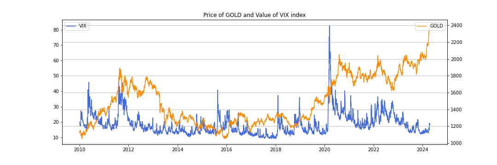
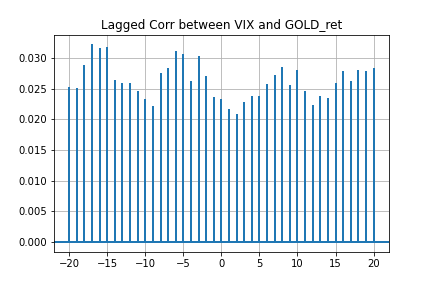
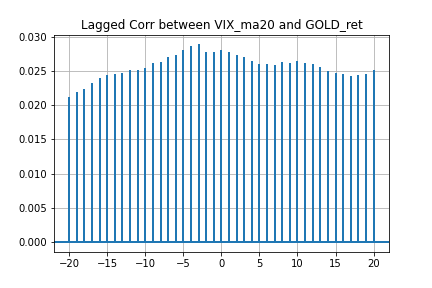
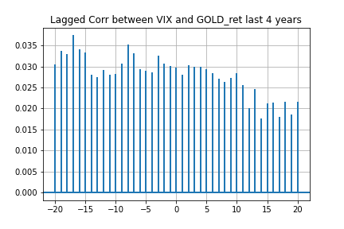
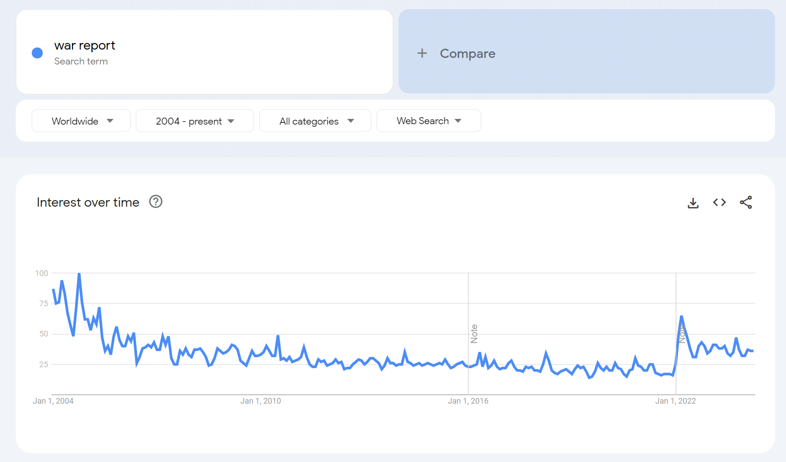

# Predict the gold price with several political risk signals

#### 1.Main Idea

- I choose Gold, a macro asset as the prediction goal.
- Gold (gc=f in CME) market is open 23 hours a day, five days a week. As a major safe haven asset, the gold price is impacted by various economic and geopolitical factors.  
- With rapid changing of the global political situation, political risk factors may play an important role in Gold price.  
- Usually the traditional data like economic/industry update on a monthly basis. We can use some indicators from social media, search engine or financial/political news to represent the uncertainty or risks for the global political environment. Since these data can be obtained more frequently, they can help us in predicting the gold price.

#### 2.Analysis and Conceptualization

##### 2.1 Analysis of Gold's relation to global markets

- Gold is a kind of precious metal, and its prices fluctuating due to various factors such as economic data releases, geopolitical tensions, and movements in the US dollar. Overall, gold futures remain a focal point for traders seeking safe-haven assets amid market uncertainties.
- Nowadays, with the change in international political situation, local conflicts are gradually increasing, and the safe-haven properties of gold are further being enhanced.

##### 2.2 Gold prices' correlation with market risks

- VIX can be seen as a proxy as investors' uncertainty about the financial market. Usually the more the VIX, the more risk we think the stock market have, and gold can provide a safe haven for investors. So we tend to think gold is positively related to VIX.
- Below is the plot of gold return and vix index
  
- Now we test the correlation of them (VIX and 20-moving average of VIX)
- 
- 
- It is obvious that the VIX has a positive correlation with gold daily return.
- The delay-1 coefficient of vix-ma20 and gold ret can ahcieve 0.023. Calculation code below:
`data["VIX_MA20"].shift(1).corr(data["log_ret_gc"])`
- 
- Test for about recent 4 years shows that the positive correlation of 2020-05 to 2024-04 are higher than the period began from 2010, implying a higher risk reflection level.

##### 2.3 More information we can use to predict the gold price

- There are many news/reports/social media posts we can use to define the  global uncertainty or the political risks, such as wars/conflicts related google trends, news(title/whole article), and research reports. Some of them are more timely resources, like news.
- Here we firstly use some google trends as political risk factor.
- 
- We obtain the keyword "war report" (the keyword "war" would include many game information or other things we don't need) monthly google trends data from google, and test correlation between the gold monthly ret with it. (resample the gold to monthly close and calculate the return)
`gold_month_ret["GC=F"].corr(google_trends_monthly["war_report"].shift(1)[1:])`
- And the result shows that the google trends of "war report" can have a coefficient of 0.013 with next month's gold return
- The google trends can actually be obtained day by day, but the data scale should be carefully dealt with because the time range decide the relative data range.
- Test the coefficient of google trends and next day's gold ret from 2023/08/01 to now:
- `new_test["war_report"].shift(1).corr(new_test["log_ret_gc"])`  shows a coef of 0.155, a strong positive one, suggests it can be a good factor to do gold ret prediction day by day.
- More alpha signals can be constructed based on these basic data, like `new_test["war_report"]-new_test["war_report"].rolling(20).mean()`, `new_test["war_report"].rolling(20).std()` and so on。

##### 2.4 Examples of More indicators

- More keywords in google trends: eg. "area conflicts"/"military conflicts"/"weighs sanctioning"/"missle fires"
- Other imformation in research engine: the number of research result
- Social media: text from tiktok/X/facebook and so on
- text from forum or research reports
- other related assets: precious metal/BTC/USD/bond rate

##### 2.5 Conceptualization

- Let $R_t$ denote the comprehensive political risk on day $t$, and $r_{t}^{gold}$ be the return of gold. We want to find a best $R_t$ as factor to predict the $r_{t}^{gold}$
- Let $R_{t}^{num}$ and $R_{t}^{text}$ denote the number based risk factor vector and text based risk factor vector respectively, $R_{t}^{num}$ have some elements: $R_{t}^{1}$ , $R_{t}^{2}$ ,... and so as $R_{t}^{text}$ . The text-based factor usually apply statistic method like term frequency or NLP method like sentiment score to the original data.
- $R_{t} = a * R_{t}^{num} + b * R_{t}^{text}$ 
- a and b are vectors help us finally get a normed, reasonably weighted factor.

#### 3. More discussion

- The political risk factor is an alternative factor and it is almost independent of the price-volume data. It can help us in better constructing a big prediction model for gold, reflecting the political environment and social reaction to public events, with all other factors including price-volume/industry fundamentals and so on.
- The effectiveness of the factor can be examined by IC(corr) or marginal gain to the overall model (tree or MLP).
